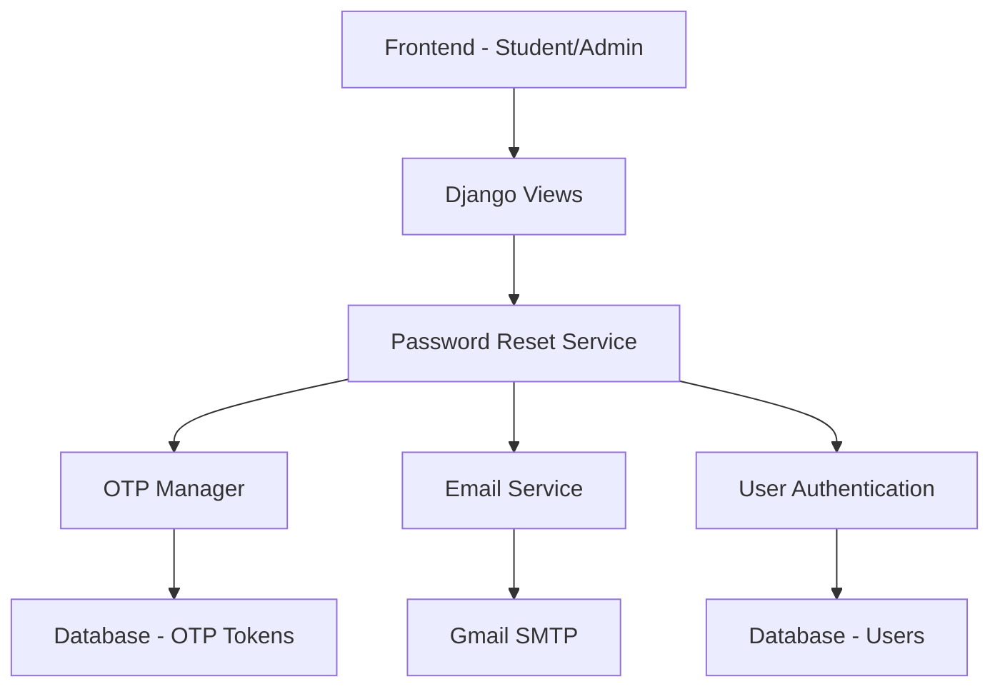
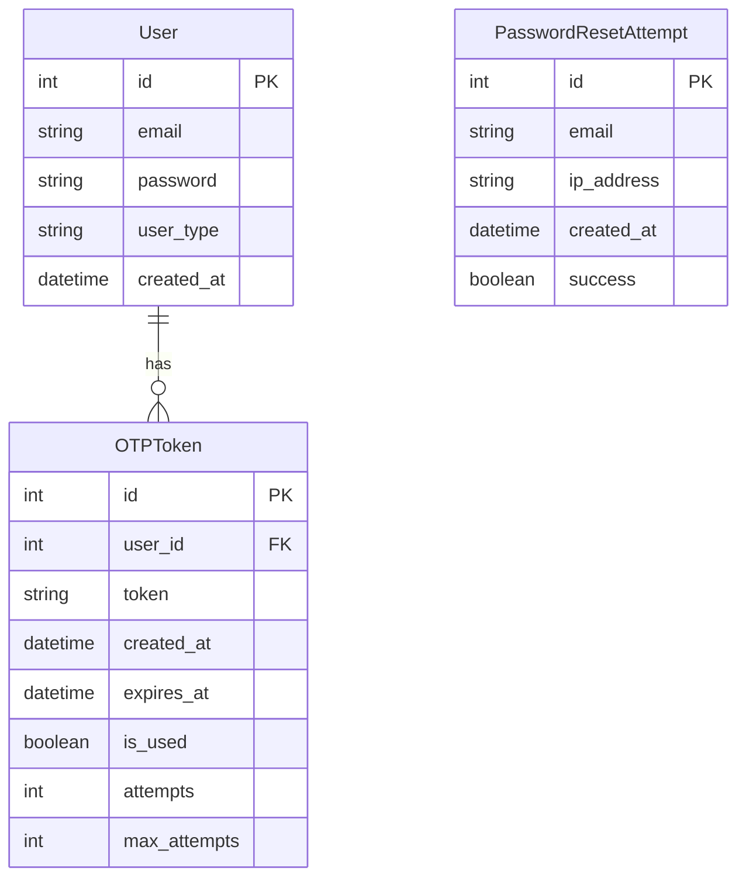

# Design Document: Email OTP Password Reset System

## Overview

This document outlines the design for implementing an email OTP (One-Time Password) system for password reset functionality in the Django backend. The system will integrate Gmail SMTP for email delivery and provide secure password reset capabilities for both student and admin users.

## Architecture

The system follows a layered architecture with clear separation of concerns:



### Key Components:
- **Frontend Layer**: React components for password reset forms
- **API Layer**: Django REST Framework views and serializers
- **Service Layer**: Business logic for password reset operations
- **Data Layer**: Models for OTP tokens and user management
- **External Services**: Gmail SMTP for email delivery

## Components and Interfaces

### 1. Django Models

#### OTPToken Model
```python
class OTPToken(models.Model):
    user = models.ForeignKey(User, on_delete=models.CASCADE)
    token = models.CharField(max_length=6)
    created_at = models.DateTimeField(auto_now_add=True)
    expires_at = models.DateTimeField()
    is_used = models.BooleanField(default=False)
    attempts = models.IntegerField(default=0)
    max_attempts = models.IntegerField(default=3)
    
    class Meta:
        ordering = ['-created_at']
```

#### PasswordResetAttempt Model (for rate limiting)
```python
class PasswordResetAttempt(models.Model):
    email = models.EmailField()
    ip_address = models.GenericIPAddressField()
    created_at = models.DateTimeField(auto_now_add=True)
    success = models.BooleanField(default=False)
```

### 2. Service Classes

#### OTPService
```python
class OTPService:
    @staticmethod
    def generate_otp() -> str
    @staticmethod
    def create_otp_token(user: User) -> OTPToken
    @staticmethod
    def verify_otp(email: str, token: str) -> bool
    @staticmethod
    def invalidate_user_otps(user: User) -> None
    @staticmethod
    def is_otp_valid(otp_token: OTPToken) -> bool
```

#### EmailService
```python
class EmailService:
    @staticmethod
    def send_otp_email(user: User, otp: str) -> bool
    @staticmethod
    def send_password_reset_confirmation(user: User) -> bool
    @staticmethod
    def get_email_template(template_name: str) -> str
```

#### RateLimitService
```python
class RateLimitService:
    @staticmethod
    def is_rate_limited(email: str, ip_address: str) -> bool
    @staticmethod
    def record_attempt(email: str, ip_address: str, success: bool) -> None
    @staticmethod
    def get_remaining_attempts(email: str) -> int
```

### 3. API Endpoints

#### Student Password Reset Endpoints
- `POST /api/students/password-reset/request/` - Request OTP
- `POST /api/students/password-reset/verify/` - Verify OTP
- `POST /api/students/password-reset/confirm/` - Set new password

#### Admin Password Reset Endpoints
- `POST /api/admin/password-reset/request/` - Request OTP
- `POST /api/admin/password-reset/verify/` - Verify OTP
- `POST /api/admin/password-reset/confirm/` - Set new password

### 4. Serializers

#### PasswordResetRequestSerializer
```python
class PasswordResetRequestSerializer(serializers.Serializer):
    email = serializers.EmailField()
    
    def validate_email(self, value):
        # Email format validation
        return value
```

#### OTPVerificationSerializer
```python
class OTPVerificationSerializer(serializers.Serializer):
    email = serializers.EmailField()
    otp = serializers.CharField(max_length=6, min_length=6)
    
    def validate_otp(self, value):
        # OTP format validation (6 digits)
        return value
```

#### PasswordResetConfirmSerializer
```python
class PasswordResetConfirmSerializer(serializers.Serializer):
    email = serializers.EmailField()
    otp = serializers.CharField(max_length=6, min_length=6)
    new_password = serializers.CharField(min_length=8)
    confirm_password = serializers.CharField(min_length=8)
    
    def validate(self, attrs):
        # Password matching validation
        # Password strength validation
        return attrs
```

## Data Models

### Database Schema



### Data Flow

1. **OTP Request Flow**:
   - User submits email → Rate limit check → User lookup → OTP generation → Email sending → Response

2. **OTP Verification Flow**:
   - User submits OTP → Token lookup → Expiration check → Attempt validation → Success/Failure response

3. **Password Reset Flow**:
   - User submits new password → OTP re-verification → Password validation → Password update → Token invalidation

## Error Handling

### Error Response Format
```json
{
    "success": false,
    "message": "User-friendly error message",
    "code": "ERROR_CODE",
    "details": {}
}
```

### Error Codes
- `RATE_LIMIT_EXCEEDED`: Too many requests
- `INVALID_OTP`: OTP is incorrect or expired
- `OTP_EXPIRED`: OTP has expired
- `MAX_ATTEMPTS_EXCEEDED`: Too many OTP verification attempts
- `WEAK_PASSWORD`: Password doesn't meet requirements
- `EMAIL_SEND_FAILED`: Failed to send email
- `USER_NOT_FOUND`: User doesn't exist (internal use only)

### Error Handling Strategy
- Never reveal if an email exists in the system
- Always return success for email requests (security)
- Provide clear, actionable error messages
- Log all errors for monitoring
- Implement graceful degradation for email failures

## Testing Strategy

### Unit Tests
- Test OTP generation and validation logic
- Test email service functionality
- Test rate limiting mechanisms
- Test password validation rules
- Test serializer validation

### Integration Tests
- Test complete password reset flow
- Test email delivery integration
- Test database operations
- Test API endpoint responses
- Test error handling scenarios

### Property-Based Tests
- Test OTP uniqueness across multiple generations
- Test rate limiting effectiveness
- Test email template rendering with various inputs
- Test password strength validation with random inputs

### Security Tests
- Test for timing attacks
- Test rate limiting bypass attempts
- Test OTP brute force protection
- Test email injection vulnerabilities
- Test CSRF protection

## Frontend Integration

### Student Side Components

#### ForgotPasswordForm
```typescript
interface ForgotPasswordFormProps {
  onSubmit: (email: string) => void;
  loading: boolean;
  error?: string;
}
```

#### OTPVerificationForm
```typescript
interface OTPVerificationFormProps {
  email: string;
  onSubmit: (otp: string) => void;
  onResend: () => void;
  loading: boolean;
  error?: string;
  timeRemaining: number;
}
```

#### NewPasswordForm
```typescript
interface NewPasswordFormProps {
  email: string;
  otp: string;
  onSubmit: (password: string, confirmPassword: string) => void;
  loading: boolean;
  error?: string;
}
```

### Admin Side Components
- Similar components with admin-specific styling and endpoints
- Separate routing and state management
- Admin-specific validation rules if needed

### State Management
```typescript
interface PasswordResetState {
  step: 'request' | 'verify' | 'reset';
  email: string;
  loading: boolean;
  error: string | null;
  success: boolean;
  timeRemaining: number;
}
```

## Security Considerations

### OTP Security
- Use cryptographically secure random number generation
- Implement proper expiration (10 minutes)
- Limit verification attempts (3 attempts)
- Invalidate OTP after successful use
- Clear OTP from memory after processing

### Rate Limiting
- Limit requests per email (3 per hour)
- Limit requests per IP address
- Implement exponential backoff
- Monitor for abuse patterns

### Email Security
- Use TLS for SMTP connections
- Validate email addresses properly
- Sanitize email content
- Include security warnings in emails
- Use app-specific passwords for Gmail

### General Security
- Implement CSRF protection
- Use HTTPS for all endpoints
- Validate all input data
- Log security events
- Implement proper session management

## Performance Considerations

### Database Optimization
- Index on user_id and created_at for OTPToken
- Regular cleanup of expired tokens
- Efficient queries for rate limiting checks

### Email Performance
- Asynchronous email sending using Celery
- Email queue management
- Retry mechanism for failed emails
- Connection pooling for SMTP

### Caching Strategy
- Cache rate limiting data in Redis
- Cache email templates
- Cache user lookup results (with TTL)

## Correctness Properties

*A property is a characteristic or behavior that should hold true across all valid executions of a system-essentially, a formal statement about what the system should do. Properties serve as the bridge between human-readable specifications and machine-verifiable correctness guarantees.*

### Property 1: OTP Format Consistency
*For any* OTP generation request, the generated OTP should be exactly 6 digits and contain only numeric characters
**Validates: Requirements 2.1**

### Property 2: OTP Storage Completeness
*For any* OTP creation, the stored token should include user association, expiration time, and initial state values
**Validates: Requirements 2.2**

### Property 3: OTP Expiration Timing
*For any* generated OTP token, the expiration time should be exactly 10 minutes from the creation timestamp
**Validates: Requirements 2.3**

### Property 4: OTP Invalidation on New Generation
*For any* user, when a new OTP is generated, all previous OTPs for that user should be marked as invalid
**Validates: Requirements 2.4**

### Property 5: Email Format Validation
*For any* email input in password reset forms, the system should validate the email format according to RFC standards
**Validates: Requirements 3.1, 4.1**

### Property 6: Valid Email OTP Generation
*For any* valid user email provided for password reset, the system should generate and attempt to send an OTP
**Validates: Requirements 3.2, 4.2**

### Property 7: Security Response Consistency
*For any* invalid email provided for password reset, the system should return the same generic success message
**Validates: Requirements 3.3, 4.3**

### Property 8: Rate Limiting Enforcement
*For any* email address, password reset requests should be limited to 3 attempts per hour
**Validates: Requirements 3.4, 4.4, 8.1**

### Property 9: Activity Logging Completeness
*For any* password reset attempt, the system should create a log entry with timestamp, email, and outcome
**Validates: Requirements 3.5, 8.3**

### Property 10: Email Delivery Timing
*For any* OTP generation, the email should be sent within 30 seconds of token creation
**Validates: Requirements 5.1**

### Property 11: OTP Email Content Requirements
*For any* OTP email sent, it should contain the 6-digit code, expiration time, and security warnings
**Validates: Requirements 5.3, 5.4, 12.4**

### Property 12: Email Delivery Error Handling
*For any* email delivery failure, the system should handle the error gracefully without exposing internal details
**Validates: Requirements 5.5**

### Property 13: OTP Format Validation
*For any* OTP submission, the system should validate that it contains exactly 6 numeric digits
**Validates: Requirements 6.1**

### Property 14: Valid OTP Verification
*For any* valid, non-expired OTP, the system should successfully verify it against the stored token
**Validates: Requirements 6.2**

### Property 15: Expired OTP Rejection
*For any* expired OTP submission, the system should reject it with an appropriate error message
**Validates: Requirements 6.3**

### Property 16: Failed Attempt Tracking
*For any* invalid OTP submission, the system should increment the failure count for that token
**Validates: Requirements 6.4**

### Property 17: Attempt Limit Enforcement
*For any* OTP token, after 3 failed verification attempts, further attempts should be blocked
**Validates: Requirements 6.5, 8.2**

### Property 18: Password Reset Authorization
*For any* successful OTP verification, the system should allow the user to proceed with password reset
**Validates: Requirements 7.1**

### Property 19: Password Strength Validation
*For any* new password submission, the system should validate it against defined strength requirements
**Validates: Requirements 7.2**

### Property 20: Token Cleanup After Reset
*For any* successful password reset, the associated OTP token should be marked as used and invalid
**Validates: Requirements 7.4**

### Property 21: Password Change Confirmation
*For any* successful password reset, a confirmation email should be sent to the user
**Validates: Requirements 7.5**

### Property 22: User Interface Feedback
*For any* user interaction in the password reset flow, appropriate success or error messages should be displayed
**Validates: Requirements 9.5, 10.5**

### Property 23: Error Message User-Friendliness
*For any* error condition, the system should provide clear, actionable error messages without technical details
**Validates: Requirements 11.1**

### Property 24: Email Existence Privacy
*For any* email-based operation, the system should not reveal whether the email exists in the database
**Validates: Requirements 11.2**

### Property 25: Network Timeout Handling
*For any* network timeout during email operations, the system should handle it gracefully with appropriate user feedback
**Validates: Requirements 11.4**

### Property 26: Email Branding Consistency
*For any* system-generated email, it should include consistent organization branding elements
**Validates: Requirements 12.2**

### Property 27: Email Format Completeness
*For any* system email, both HTML and plain text versions should be provided
**Validates: Requirements 12.3**

### Property 28: Support Information Inclusion
*For any* system email, contact information for support should be included
**Validates: Requirements 12.5**

## Monitoring and Logging

### Metrics to Track
- Password reset request rate
- OTP verification success rate
- Email delivery success rate
- Failed authentication attempts
- Rate limiting triggers

### Logging Requirements
- All password reset attempts
- Failed OTP verifications
- Email sending failures
- Rate limiting events
- Security violations

### Alerting
- High failure rates
- Unusual request patterns
- Email service outages
- Database connection issues