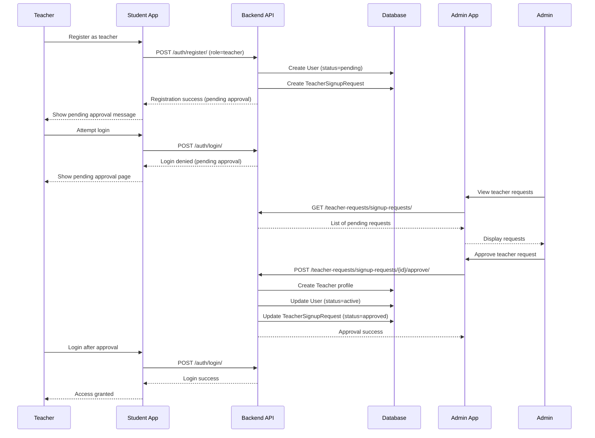

# Teacher Signup Approval Fix - Design Document

## Overview

This design addresses the critical issues in the teacher signup and approval workflow by implementing proper integration between User registration and TeacherSignupRequest creation, fixing API endpoint mismatches, and ensuring proper authentication flow for pending teacher accounts.

## Architecture

The solution involves three main components:

1. **Backend API Integration**: Fix URL routing and ensure TeacherSignupRequest creation during teacher registration
2. **Authentication Flow Enhancement**: Prevent pending teachers from accessing the system inappropriately
3. **Frontend API Alignment**: Update frontend services to use correct backend endpoints

### Component Interaction Flow



## Components and Interfaces

### 1. Enhanced Authentication Registration

**File**: `server/apps/authentication/views.py`

The registration view needs to be enhanced to create TeacherSignupRequest when a teacher registers:

```python
def register_view(request):
    # Existing user creation logic
    user = serializer.save()
    
    # NEW: Create TeacherSignupRequest for teachers
    if user.role == 'teacher':
        # Extract teacher-specific data from request
        teacher_data = extract_teacher_data(request.data)
        create_teacher_signup_request(user, teacher_data)
    
    return response
```

### 2. Teacher Signup Request Creation Service

**New Function**: `server/apps/authentication/services.py`

```python
def create_teacher_signup_request(user, teacher_data):
    """Create TeacherSignupRequest from registration data"""
    from apps.teacher_requests.models import TeacherSignupRequest
    
    TeacherSignupRequest.objects.create(
        user=user,
        full_name_english=teacher_data['full_name_english'],
        full_name_bangla=teacher_data['full_name_bangla'],
        email=user.email,
        mobile_number=user.mobile_number,
        designation=teacher_data['designation'],
        department_id=teacher_data['department'],
        qualifications=teacher_data.get('qualifications', []),
        specializations=teacher_data.get('specializations', []),
        office_location=teacher_data.get('office_location', ''),
        status='pending'
    )
```

### 3. Enhanced Registration Serializer

**File**: `server/apps/authentication/serializers.py`

```python
class RegisterSerializer(serializers.ModelSerializer):
    # Existing fields...
    
    # NEW: Teacher-specific fields (conditional)
    full_name_english = serializers.CharField(required=False)
    full_name_bangla = serializers.CharField(required=False)
    designation = serializers.CharField(required=False)
    department = serializers.UUIDField(required=False)
    qualifications = serializers.ListField(required=False, default=list)
    specializations = serializers.ListField(required=False, default=list)
    office_location = serializers.CharField(required=False, allow_blank=True)
    
    def validate(self, attrs):
        # Existing validation...
        
        # NEW: Validate teacher fields if role is teacher
        if attrs.get('role') == 'teacher':
            required_teacher_fields = [
                'full_name_english', 'full_name_bangla', 
                'designation', 'department'
            ]
            for field in required_teacher_fields:
                if not attrs.get(field):
                    raise serializers.ValidationError({
                        field: 'This field is required for teacher registration'
                    })
        
        return attrs
```

### 4. Frontend API Endpoint Correction

**File**: `client/admin-side/src/config/api.ts`

```typescript
export const API_ENDPOINTS = {
  // ... existing endpoints
  
  // FIXED: Teacher requests endpoints
  teachers: {
    // ... existing teacher endpoints
    requests: '/teacher-requests/signup-requests/',
    requestDetail: (id: string) => `/teacher-requests/signup-requests/${id}/`,
    approveRequest: (id: string) => `/teacher-requests/signup-requests/${id}/approve/`,
    rejectRequest: (id: string) => `/teacher-requests/signup-requests/${id}/reject/`,
  },
}
```

### 5. Enhanced Student-Side Registration Form

**File**: `client/student-side/src/components/auth/TeacherRegistrationForm.tsx`

```typescript
interface TeacherRegistrationData {
  // Basic user fields
  fullName: string;
  email: string;
  mobile: string;
  password: string;
  
  // Teacher-specific fields
  fullNameBangla: string;
  designation: string;
  department: string;
  qualifications: string[];
  specializations: string[];
  officeLocation?: string;
}
```

### 6. Authentication Context Enhancement

**File**: `client/student-side/src/contexts/AuthContext.tsx`

```typescript
const login = async (email: string, password: string) => {
  try {
    const response = await api.post('/auth/login/', { username: email, password });
    // Handle successful login
  } catch (error) {
    // NEW: Handle pending teacher approval
    if (error.response?.data?.code === 'authorization' && 
        error.response?.data?.message?.includes('pending approval')) {
      throw new Error('TEACHER_PENDING_APPROVAL');
    }
    throw error;
  }
};
```

## Data Models

### Enhanced User Model Validation

The existing User model is sufficient, but we need to ensure proper validation in the `can_login()` method:

```python
def can_login(self):
    """Check if user is allowed to login"""
    # Teachers with pending status cannot login
    if self.role == 'teacher' and self.account_status == 'pending':
        return False
    
    # Suspended users cannot login
    if self.account_status == 'suspended':
        return False
    
    return True
```

### TeacherSignupRequest Model Enhancements

The existing model is well-designed, but we need to ensure proper constraints:

```python
class TeacherSignupRequest(models.Model):
    # ... existing fields
    
    class Meta:
        # ... existing meta
        constraints = [
            models.UniqueConstraint(
                fields=['user'], 
                name='unique_teacher_signup_request_per_user'
            ),
            models.UniqueConstraint(
                fields=['email'], 
                name='unique_teacher_signup_request_email'
            ),
        ]
```

## Correctness Properties

*A property is a characteristic or behavior that should hold true across all valid executions of a system-essentially, a formal statement about what the system should do. Properties serve as the bridge between human-readable specifications and machine-verifiable correctness guarantees.*

### Property 1: Teacher Registration Completeness
*For any* valid teacher registration data, the system should create both a User account with status='pending' and a corresponding TeacherSignupRequest record with proper linking
**Validates: Requirements 1.1**

### Property 2: Pending Teacher Login Prevention
*For any* User account with role='teacher' and account_status='pending', login attempts should be rejected with appropriate error messages
**Validates: Requirements 1.2**

### Property 3: Teacher Registration Validation
*For any* teacher registration attempt, the system should validate all required fields (name, designation, department) and reject incomplete submissions
**Validates: Requirements 1.3**

### Property 4: Pending Teacher Request Visibility
*For any* TeacherSignupRequest with status='pending', it should appear in the admin interface teacher requests list
**Validates: Requirements 2.1**

### Property 5: Complete Teacher Request Data
*For any* TeacherSignupRequest viewed by admin, the response should contain all required personal and professional information fields
**Validates: Requirements 2.2**

### Property 6: Teacher Request Filtering
*For any* teacher request list query with filters (status, department, search), the system should return only records matching all specified criteria
**Validates: Requirements 2.3**

### Property 7: Teacher Approval Completeness
*For any* approved TeacherSignupRequest, the system should create a Teacher profile, update User account_status to 'active', and establish proper relationships
**Validates: Requirements 2.4, 4.1, 4.3**

### Property 8: Teacher Rejection State Management
*For any* rejected TeacherSignupRequest, the system should update request status while maintaining User account in pending state
**Validates: Requirements 2.5, 5.3**

### Property 9: API Endpoint Routing
*For any* API call to teacher request endpoints, the request should reach the correct backend handler without routing errors
**Validates: Requirements 3.1**

### Property 10: API Response Format Consistency
*For any* teacher request API call, the response should match the expected data structure and include all required fields
**Validates: Requirements 3.2**

### Property 11: Teacher Operation Atomicity
*For any* teacher approval or rejection operation, all database changes should complete successfully or be rolled back entirely
**Validates: Requirements 3.3, 5.2**

### Property 12: Teacher Data Consistency
*For any* teacher request creation, the system should ensure data consistency between User and TeacherSignupRequest models
**Validates: Requirements 3.4**

### Property 13: Teacher API Authorization
*For any* teacher request API endpoint access, the system should enforce proper authentication and authorization rules
**Validates: Requirements 3.5**

### Property 14: Approved Teacher Login Success
*For any* User account with role='teacher' and account_status='active', login attempts should succeed and provide full access
**Validates: Requirements 4.2**

### Property 15: Teacher Profile Relationship Integrity
*For any* teacher approval operation, the system should maintain referential integrity between User, TeacherSignupRequest, and Teacher models
**Validates: Requirements 4.4**

### Property 16: Teacher Registration Field Completeness
*For any* teacher registration, the system should create TeacherSignupRequest records with all required fields properly populated
**Validates: Requirements 5.1**

### Property 17: Teacher Data Constraint Validation
*For any* teacher data update operation, the system should validate all database constraints and relationships
**Validates: Requirements 5.4**

### Property 18: Teacher Operation Error Recovery
*For any* system error during teacher operations, the system should rollback changes and maintain data integrity
**Validates: Requirements 5.5**

## Error Handling

### Registration Errors
- **Validation Failures**: Return specific field-level errors for missing or invalid teacher data
- **Database Constraints**: Handle unique constraint violations gracefully
- **Department Validation**: Ensure selected department exists and is active

### Authentication Errors
- **Pending Approval**: Provide clear messaging for teachers awaiting approval
- **Account Suspension**: Handle suspended accounts with appropriate messaging
- **Invalid Credentials**: Maintain security while providing helpful feedback

### API Errors
- **Endpoint Not Found**: Ensure proper error handling for URL mismatches
- **Permission Denied**: Validate admin permissions for teacher request operations
- **Data Consistency**: Handle concurrent modification scenarios

### Approval Process Errors
- **Duplicate Approval**: Prevent multiple approvals of the same request
- **Missing Dependencies**: Validate department and other required data before approval
- **Transaction Failures**: Rollback partial changes and provide meaningful error messages

## Testing Strategy

### Unit Testing
- Test User model `can_login()` method with various account statuses
- Test TeacherSignupRequest creation during registration
- Test API endpoint routing and response formats
- Test approval/rejection transaction handling

### Property-Based Testing
- Generate random teacher registration data and verify complete record creation
- Test login attempts with various user states and verify appropriate responses
- Generate random approval/rejection scenarios and verify data consistency
- Test API endpoint calls with various parameters and verify correct routing

### Integration Testing
- Test complete teacher registration flow from frontend to database
- Test admin approval workflow from request list to teacher profile creation
- Test authentication flow for pending vs approved teachers
- Test error scenarios and rollback behavior

The testing approach will use Django's built-in testing framework for unit tests and Hypothesis for property-based testing to ensure comprehensive coverage of the teacher signup approval system.